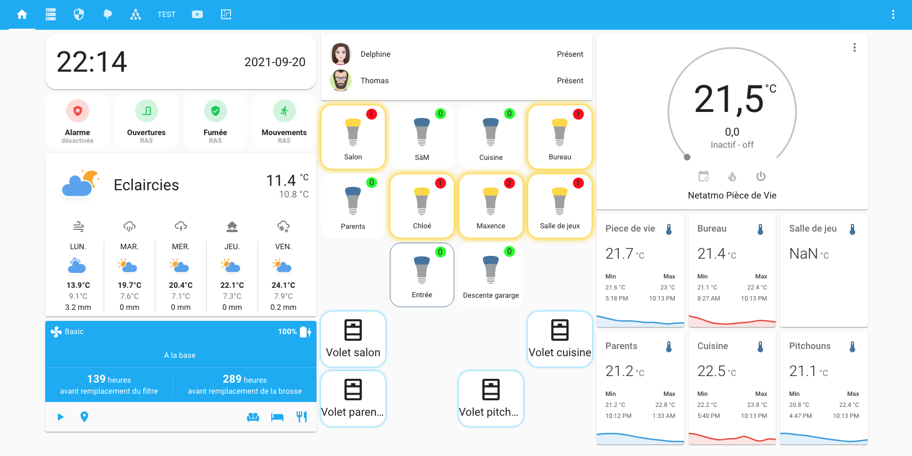
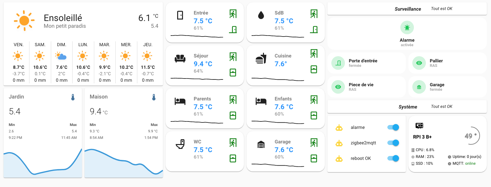

# Ma configuration Home Assistant
Il s'agit de ma configuration [Home Assistant](https://home-assistant.io) tournant sur un petit serveur NUC sous Ubuntu 20.04 LTS.
Si cela vous intéresse et si vous voulez suivre l'évolution de mon installation n'oubliez pas de cliquer sur ⭐️ .

Dans un premier temps l'idée est de proposer un tableau de bord utilisé principalement sur un ordinateur car c'est à partir de mon ordinateur que je mets tout en place. Après ce tableau de bord sera adapté pour être plus agréable à utiliser sur un smartphone ou encore sur une tablette qui pourra être au coeur de la maison et à partir de laquelle il sera possible de tout controller.

Mon tableau de bord s'articule donc autour de plusieurs vues : un tableau principal où j'ai placé les informations qui sont primordiales pour la famille et les quelques actions que l'on fait quotidiennement ou presque.

Ensuite une vue qui n'est utile qu'à moi et qui n'est d'ailleurs visible que de moi : la partie système qui me permet d'avoir un visuel immédiat sur le serveur hébergeant le système domotique, l'état de santé de Home Assistant ainsi que des conteneurs qui tournent sur mon serveur et qui sont principalement en lien avec Home Assistant.

Une vue importante : celle qui concerne la sécurité avec l'affichage des diiférentes caméras mais aussi un retour des différents capteurs.

Une vue qui a fait son apparition dernièrement : celle pour contrôler mon imprimante 3D. En effet celle-ci est raccordée à une prise connectée qui me permet de l'allumer et surtout de l'éteindre à la fin d'une impression. Je peux aussi faire un suivi relativement fin de la quantité de filaments encore en stock.

Ayant la change d'avoir une maison de famille, je voulais garder un oeil sur cette maison en mon absence. Pour cela j'ai utilisé un raspberry pi sur lequel j'ai simplement installé Zigbee2MQTT. Je récupére ainsi les informations de mes différents capteurs et je les envoie sur mon broker MQTT principal que j'héberge à mon domicile principal. Je n'ai ainsi eu qu'à créer les sensors dans mon Home Assistant. Je n'ai ainsi qu'un seul Home Assistant dans lequel toutes les informations remontent.
J'ai simplement créé une vue spécifique pour ce domicile ensuite afin que je puisse avoir sur une même page toutes les informations remontées à savoir : la température extérieure, la teméprature dans les différentes pièces de la maison (des capteurs doivent encore être ajoutés), l'état des capteurs de détection de présence et d'ouverture/fermeture de portes et fenêtres (là encore des capteurs doivent être ajoutés dans le futur).
Ce système fonctionne sur un raspberry pi 3 B+ avec un SSD. Le raspberry pi est branché à un modem 4G pour pouvoir envoyer les informations.

Afin d'avoir une vision de mon système domotique rapidement et depuis un poste utilisant Chrome j'ai mis en place l'extension Home Assistant. Un nouveau tableau de bord a été créé spécifiquement pour cela car l'affichage est spécifique et l'idée est d'avoir les informations essentielles en un coup d'oeil.
Cette vue est l'affichage que de certaines briques présentes dans mon tableau de bord principal mais vous pourrez trouver le code [ici](https://github.com/journaldethomas/home-assistant-config/blob/main/export-lovelace-extension.yaml)

### Mais où est le code ?
Je suis en mode UI c'est à dire que mon tableau de bord est réalisé directement à partir de l'interface de Home Assistant. J'avais réalisé mes premiers tableaux de bord en mode YAML mais les dernières versions de Home Assistant me permettent de faire la même chose directement à partir de l'interface ce qui simplifie grandement les choses. Je partage donc mon tablea de bord en faisant un export de l'éditeur de configuration. Vous pourrez retrouver le code complet dans le fichier [export-lovelace.yaml](https://github.com/journaldethomas/home-assistant-config/blob/main/export-lovelace.yaml)

Pour ce qui est de la configuration à proprement parlé avec la définition de mes sensors, des templates et des différentes informations que je souhaite connaitre sur mon système domotique, vous trouverez tout dans le fichier [configuration.yaml](https://github.com/journaldethomas/home-assistant-config/blob/main/configuration.yaml). Je ne scinde pas encore ce fichier de configuration mais cela sera un travail que je ferais très certainement dans le futur.

Cela fait maintenant plus d'un an que j'utilise Home Assistant et je veux partager avec vous ma configuration complète. J'essaie de faire ça le mieux possible toujours en documentant mon travail et en versionnant mes mises à jour. Je garderais ainsi un historique de mes modifications.

### Et à propos de mon installation ?

Voici une partie de mon matériel :
- Clé USB Conbee II pour me passer de la plupart des passerelles Zigbee;
- Clé USB Aeotec Z-Wave Plus Z-Stick Gen5 pour centraliser tous les équipements Z-Wave;
- Phillips Hue avec pont et ligthstrip, spots GU10 x4, ampoules E27 x7;
- Ikea Tradfri spots GU10 x4;
- Spot lumineux AwoX x2;
- Station météo NetAtmo avec pluviomètre;
- Capteurs température Aqara x4;
- Détecteurs mouvement Aqara;
- Détecteurs de mouvement Aeotec x2;
- Détecteurs ouverture porte Aqara;
- Détecteurs ouverture porte Aeotec x2;
- Module Z-Wave Fibaro FGD-212;
- Prise connectées Osram x3;
- Prise connectée SmaBit;
- Robot aspirateur Dreame D9;
- Détecteur de fumée Fibaro x2.

Et pour la partie plus « IT » :
- Un rack 15U dans le garage;
- UniFi UDM Pro;
- Switch D-Link 24 que je pense remplacer par un switch Unifi prochainement;
- Access Point UniFi AC-Lite;
- NUC Intel NUC8i3BEH 16GB;
- NAS Synology DS418j;
- Onduleur Eaton Ellipse Pro 650.
